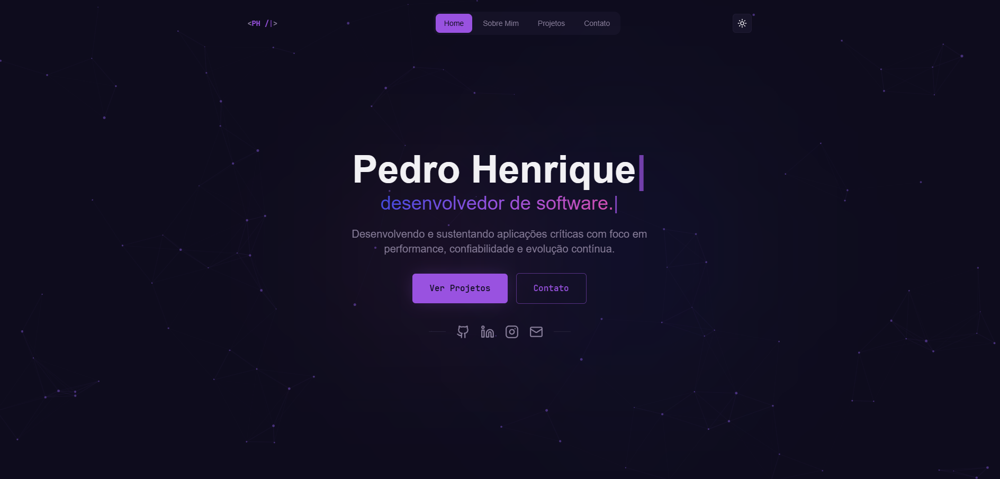

# 💻 PEDRO HENRIQUE – Software Developer

[](https://react.dev/)
[](https://tailwindcss.com/)
[](https://www.framer.com/motion/)
[](https://lucide.dev/)
[](https://www.typescriptlang.org/)

---

Acesse o site: [https://portfolio-six-iota-tu03rl1l2b.vercel.app/](https://portfolio-six-iota-tu03rl1l2b.vercel.app/)



---

## 🧠 Sobre o Projeto

Este é o meu portfólio pessoal, uma aplicação web moderna e responsiva desenvolvida para apresentar meus projetos, habilidades e trajetória profissional como desenvolvedor de software. O site oferece:

- 🎯 **Trajetória Profissional**: Detalhes sobre minha jornada e evolução na área.
- 🖼️ **Showcase de Projetos**: Galeria interativa dos principais projetos com links diretos.
- 💡 **Tecnologias & Skills**: Seção dedicada às ferramentas e linguagens que domino.
- 📱 **Interface Premium**: Design responsivo com animações fluidas e background interativo de partículas.
- 📢 **Contato**: Links integrados para redes sociais e e-mail.

---

## ⚙️ Tecnologias Utilizadas

### 🎨 Front-end (React + Vite)

| Biblioteca         | Finalidade                                                      |
| :----------------- | :-------------------------------------------------------------- |
| **React**          | Framework principal para construção da interface                |
| **Vite**           | Ferramenta de build e servidor de desenvolvimento ultra-rápido  |
| **Tailwind CSS**   | Estilização moderna baseada em utilitários                      |
| **Framer Motion**  | Animações suaves, transições e efeitos de scroll                |
| **Lucide React**   | Pack de ícones consistente e leve                               |
| **Shadcn UI**      | Componentes de interface acessíveis e altamente customizáveis   |
| **TanStack Query** | Gerenciamento de estado, cache e requisições assíncronas        |
| **TypeScript**     | Superset JavaScript para tipagem estática e segurança de código |
| **Vitest**         | Framework de testes para garantir a qualidade do código         |
| **Recharts**       | Biblioteca de gráficos interativos (se aplicável ao portfólio)  |

---

## ▶️ Como Executar

### Pré-requisitos

- Node.js instalado
- NPM ou Bun

### Passos para execução

```bash
# 1. Instale as dependências
npm install

# 2. Rode o projeto localmente
npm run dev
```

O projeto estará disponível em `http://localhost:8080` (ou na porta configurada pelo Vite).
